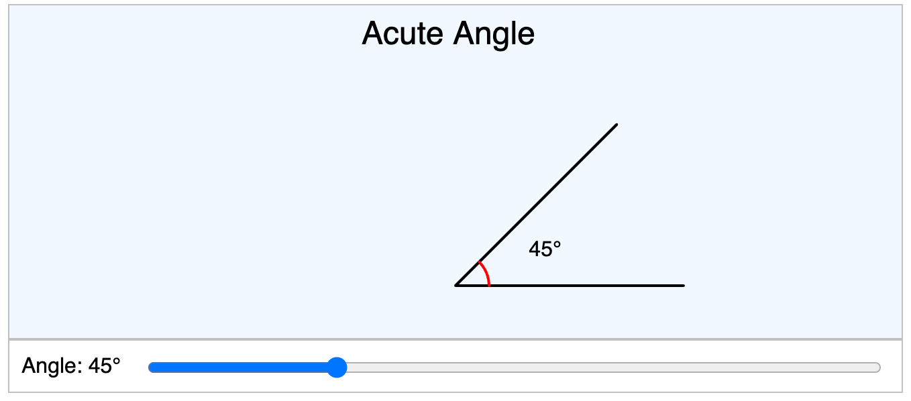

# Angle Explorer MicroSim

{ width="400" }

[Run the MicroSim Template](./angle-explorer.html){ .md-button .md-button--primary }
[Edit this MicroSim](https://editor.p5js.org/dmccreary/sketches/dJq4nTXE4)

## Sample Prompt

```linenums="0"
Prompt Name: Angle Explorer in p5.js 

You are a expert at generating p5.js sketches to help students learn 
basic high-school level geometry. This p5.js sketch is part of a 
geometry course is offered to students in the 9th through 12th grade. 
Students have taken basic algebra courses and they understand equations. 
You are helping geometry teachers explain concepts in geometry. 
The topic this week is angles. Create a p5.js sketch that will
adjust rays to form different angles and measure them dynamically.
Use a slider placed in the bottom control area to adjust the angle.
Have the name of the type of angle change as the angle moves.
```

[MicroSim Template for 2D Geometry](../templates/microsim-2d-geometry.js)

## Sample Response

### Workflow

Navigating class insights

**Crafting a lesson plan**

I'm tasked with developing a lesson plan for high school students using a MicroSim. It should encompass objectives, key concepts, activities, and questions, ensuring factual accuracy and no disallowed content.

**Integrating education**

I'm combining elements for a lesson: objectives, key concepts, and interactive activities using MicroSim to engage students in understanding angles effectively.

**Understanding angle variations**

I aim to help students identify different angles, measure them, and use the Angle Explorer MicroSim to rotate rays and form various angles. This approach fosters an intuitive grasp of angle transformations.

**Engaging students**

I'm pulling together an introduction to angles, spotlighting their types and real-world instances. Then, I'll introduce the Angle Explorer MicroSim, guiding students to manipulate angles and identify acute and right angles.

**Setting angles**

I'm setting and exploring different angles, noting the transition from acute to obtuse at 90°. Observing how rays align and identifying real-life examples.

**Navigating class insights**

I'm pulling together the key findings from the independent practice to spark a class discussion. This will encourage students to share intriguing angles and real-world examples they've discovered.

### Reflecting and reinforcing concepts

Taking a moment to summarize key angles concepts and connecting angle measure to type.

